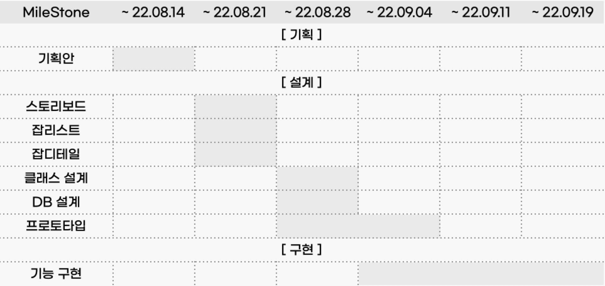

# 아기로그 (agi-log)

## 프로젝트 소개
> **_아기의 건강을 관리하자_**

기존 서비스의 육아일기 말고 매일 아이의 건강을 기록하여, 아이가 아플 때 전문의에게 진료를 더 편히 볼 수 있게 해주는 웹서비스
 

## 팀원소개
|이름|역활|업무|
|:---:|:---:|:---:|
|김재필|엔지니어|기업_의사관리, 기업_환자관리, 일반_감성일기, 일반_게시판|
|최지수|기획자|일반_감성일기, 일반_캘린더, 일반_마이페이지, 기업_예약관리|
|김태훈|PM|DB설계, 일반_감성일기, 일반_자유게시판, 일반_예약관리|
|염설화|팀장|DB설계, 일반_감성일기, 일반_건강일기, 일반_지도, 일반_자유게시판|
|한슬기|PM|일반_감성일기, 일반_건강일기, 일반_캘린더, 일반_게시판, 기업_예약관리|
 

## 사용기술
> **언어**  

- HTML5
- CSS3
- JAVASCRIPT
- JAVA

> **프레임워크**

- Spring Framework
- MyBatis 3.5.10
	
> **서버**

- Apache Tomcat 9.0

> **DB**  

- Oracle 11g

> **IDE**  

- Eclipse 2022-03
- SQL Developer
- Visual Studio Code

> **라이브러리** 
 
- Bootstrap
- FullCalender
- billboard.js
- Three.js
- SweetAlert
- Smart Editor2
- GSON
- JQuery

> **API**  

- KAKAO/NAVER Login
- KAKAO Map
- DAME 주소검색
- 사업자등록번호 진위확인
- 카페24

> **ETC**  

- GitHub
- Excel
- PowerPoint
- eXERD
- Discord
 

## 개발기간 (WBS)

 

## ERD

